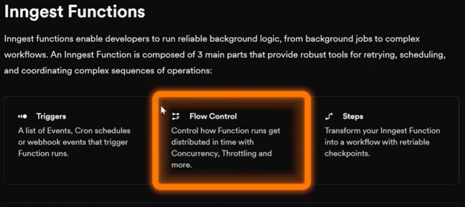
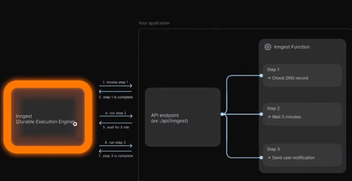

<h1 align="center">🤖 Production-Ready RAG AI Agent</h1>

<p align="center">
  
  
  
  
  
  
</p>

<p align="center">
  A <strong>production-grade Retrieval-Augmented Generation (RAG) AI Agent</strong> built with Python — featuring real-world engineering concerns like observability, retries, rate limiting, orchestration, and a full Streamlit UI. This is not a demo script — it's an end-to-end deployable AI service.
</p>

---

## 🎬 Inspiration & Credit

> This project was built following and extending the concepts from the excellent YouTube tutorial:
>
> 📺 **[Production-Ready RAG AI Agent — YouTube Tutorial](https://www.youtube.com/watch?v=AUQJ9eeP-Ls)**
>
> Huge credit to the creator for the clear and practical walkthrough. This repo applies those concepts, structures the code for real deployment, and adds additional production enhancements.

---

## 🧠 Why This Project Stands Out

Most RAG projects are Jupyter notebooks or simple scripts. This repo is architected **like a real production service** — the way an engineering team at a company would actually build and ship it.

| Feature | Typical RAG Demo | This Project |
|---|---|---|
| Observability & Logging | ❌ | ✅ |
| Retry Logic | ❌ | ✅ |
| Rate Limiting | ❌ | ✅ |
| Workflow Orchestration | ❌ | ✅ Inngest |
| Vector DB Integration | Basic | ✅ Modular |
| Interactive UI | ❌ | ✅ Streamlit |
| Modular Architecture | ❌ | ✅ |
| Deployment Ready | ❌ | ✅ |

---

## 🏗️ Architecture Overview
```
User Query
    │
    ▼
┌─────────────────────────────────────┐
│         Streamlit Frontend          │
│         (streamlit_app.py)          │
└──────────────┬──────────────────────┘
               │
               ▼
┌─────────────────────────────────────┐
│        Inngest Orchestrator         │
│  (Retries / Rate Limits / Logging)  │
└──────────────┬──────────────────────┘
               │
       ┌───────┴────────┐
       ▼                ▼
┌────────────┐   ┌──────────────────┐
│ Vector DB  │   │   LLM / OpenAI   │
│ Retrieval  │   │  Response Gen    │
│(vector_db) │   │   (main.py)      │
└────────────┘   └──────────────────┘
       ▲
       │
┌──────────────┐
│ Data Loader  │
│(data_loader) │
└──────────────┘
```

---

## ✨ Key Features

- 🔁 **Retry Policies** — Automatic exponential backoff on flaky LLM/API calls
- 🚦 **Rate Limiting** — Guards against API overuse and runaway costs
- 👁️ **Observability** — Structured logging and debug-friendly outputs throughout
- ⚙️ **Inngest Orchestration** — Serverless-style durable workflow management
- 🗃️ **Vector Database** — Fast semantic search over ingested documents
- 🖥️ **Streamlit UI** — Clean, interactive frontend for querying the RAG agent
- 🧩 **Modular Design** — Every component (loader, vector DB, LLM, UI) is independently swappable
- 🐍 **Modern Python** — Uses `pyproject.toml`, `uv` lock file, and pinned Python version

---

## 🛠️ Tech Stack

| Layer | Technology |
|---|---|
| Language | Python 3.11+ |
| Workflow Orchestration | [Inngest](https://www.inngest.com/) |
| LLM Backend | OpenAI API |
| Vector Store | Configurable (ChromaDB / Pinecone / etc.) |
| Frontend | Streamlit |
| Dependency Management | `uv` + `pyproject.toml` |
| Logging | Python standard logging |
| Deployment | Docker / Cloud-ready |

---

## 📁 Project Structure
```
Production-Ready_RAG_AI_Agent/
│
├── main.py                 # Core RAG pipeline & Inngest functions
├── streamlit_app.py        # Interactive Streamlit frontend
├── data_loader.py          # Document ingestion & preprocessing
├── vector_db.py            # Vector store setup & semantic search
├── custom_types.py         # Pydantic models & shared data types
├── pyproject.toml          # Project dependencies & config
├── uv.lock                 # Locked dependency versions
├── .python-version         # Pinned Python version
├── .env.sample             # Environment variable template
├── inngest_function.jpg    # Inngest dashboard screenshot
├── inngest_working.jpg     # Inngest workflow diagram
└── README.md
```

---

## 🚀 Quick Start

### 1. Clone the Repository
```bash
git clone https://github.com/krutipandy/Production-Ready_RAG_AI_Agent.git
cd Production-Ready_RAG_AI_Agent
```

### 2. Set Up Environment
```bash
# Copy the environment template
cp .env.sample .env
```

Edit `.env` and fill in your credentials:
```env
OPENAI_API_KEY=your_openai_key_here
INNGEST_EVENT_KEY=your_inngest_event_key
INNGEST_SIGNING_KEY=your_inngest_signing_key
VECTOR_DB_URL=your_vector_db_connection
```

### 3. Install Dependencies

**Using `uv` (recommended):**
```bash
pip install uv
uv sync
```

**Using pip:**
```bash
pip install -r requirements.txt
```

### 4. Ingest Your Data
```bash
python data_loader.py
```

### 5. Run the Backend
```bash
python main.py
```

### 6. Launch the Frontend
```bash
streamlit run streamlit_app.py
```

Open your browser at `http://localhost:8501` and start querying your AI agent!

---

## ⚙️ Inngest Orchestration

This project uses [Inngest](https://www.inngest.com/) to handle the RAG pipeline as a **durable, observable workflow** — not a fragile chain of function calls.

**Why Inngest?**
- Each step is logged and visible in a live dashboard
- If an LLM call fails, Inngest automatically retries with backoff
- Rate limiting is enforced at the orchestration layer
- Steps can be paused, replayed, and debugged individually

### Inngest Dashboard


### Inngest Workflow in Action


---

## 🔄 How RAG Works in This Project
```
1. INGESTION
   Documents → data_loader.py → Chunked & Embedded → Vector DB

2. RETRIEVAL
   User Query → Embedded → Semantic Search → Top-K Relevant Chunks

3. GENERATION
   Relevant Chunks + User Query → LLM Prompt → AI Response

4. ORCHESTRATION (via Inngest)
   Each step above is a durable function with retries, logging & rate limits
```

---

## 🌐 Deployment Guide

### Docker (Recommended)
```dockerfile
FROM python:3.11-slim
WORKDIR /app
COPY . .
RUN pip install uv && uv sync
EXPOSE 8501
CMD ["streamlit", "run", "streamlit_app.py", "--server.port=8501"]
```
```bash
docker build -t rag-ai-agent .
docker run -p 8501:8501 --env-file .env rag-ai-agent
```

### Cloud Deployment Options
- **AWS** — ECS / Lambda + API Gateway
- **GCP** — Cloud Run
- **Azure** — Container Apps
- **Railway / Render** — One-click deploy from GitHub

---

## 💡 Use Cases

- 📄 **Document Q&A** — Chat with PDFs, reports, and knowledge bases
- 🏢 **Enterprise Search** — Internal knowledge retrieval with LLM answers
- 🎓 **Education Tools** — Course material Q&A assistant
- 🛠️ **Developer Tools** — Code documentation assistant
- 🩺 **Healthcare / Legal** — Retrieval over specialized domain documents

---

## 🔭 Future Enhancements

- [ ] Add **multi-document support** with metadata filtering
- [ ] Integrate **LangGraph** for advanced agent reasoning loops
- [ ] Add **evaluation pipeline** (RAGAS / TruLens) for answer quality scoring
- [ ] Implement **streaming responses** in Streamlit UI
- [ ] Add **authentication** layer for multi-user deployments
- [ ] Build **CI/CD pipeline** with GitHub Actions

---

## 👩‍💻 Author

**Kruti Pandya**  
AI/ML Engineer | LLM & RAG Systems | Production AI Applications

[](https://github.com/krutipandy)

---

## 🙏 Acknowledgements

- 📺 **Tutorial Credit:** [Production-Ready RAG AI Agent — YouTube](https://www.youtube.com/watch?v=AUQJ9eeP-Ls) — for the foundational concepts and walkthrough that inspired this project.
- ⚙️ [Inngest](https://www.inngest.com/) — for the powerful workflow orchestration platform
- 🤖 [OpenAI](https://openai.com/) — for the LLM backbone
- 🖥️ [Streamlit](https://streamlit.io/) — for the rapid UI framework

---

## 📄 License

This project is open-source and available under the [MIT License](LICENSE).

---

<p align="center">⭐ If this project helped you understand production RAG systems, please give it a star!</p>
